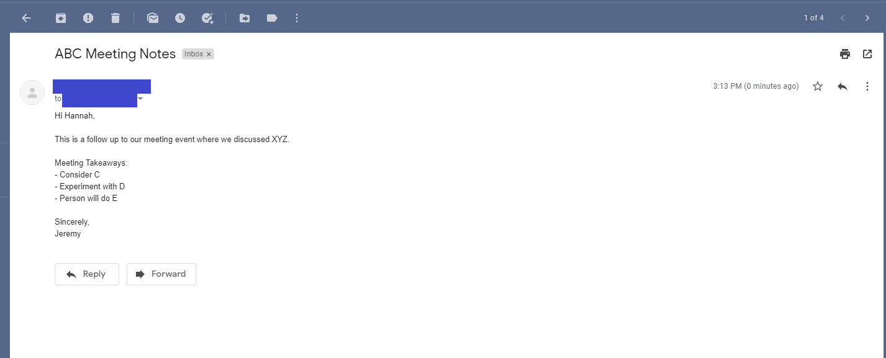

<!-- PROJECT LOGO -->
 

  

  <h1 align="center" style="border:none" >Squidy</h1>

  

    A Google Calendar add-on that allows you to record personal meeting notes!
     
     
    <a href="#demo">View Demo</a>
    ·
    <a href="https://github.com/duchess-toffee/squidy/issues">Report Bug</a>
    ·
    <a href="https://github.com/duchess-toffee/squidy/issues">Request Feature</a>
  

  
 
 

<!-- TABLE OF CONTENTS -->

## Table of Contents

- :sparkles: [About the Project](#sparkles-about-the-project)
  - :thinking: [What does Squidy Do?](#thinking-what-does-squidy-do)
  - :wrench: [Built With](#wrench-built-with)
  - :eyes: [Demo](#eyes-demo)
- :rocket: [Getting Started](#rocket-getting-started)
  - :key: [Setup](#key-setup)
  - :fire: [Installation](#fire-installation)
- :traffic_light: [Roadmap](#traffic_light-roadmap)
- :handshake: [Contributing](#handshake-contributing)
- :phone: [Contact](#phone-contact)
- :books: [Resources](#books-resources)

 
 

<!-- ABOUT THE PROJECT -->

## :sparkles: About The Project

I came to build Squidy due to a need that I ran into as an employee. I've always wanted an easier (or more concise) way to take meeting notes and email them out to meeting members afterwards.

Before I started learning to code, I was taking notes in Google Docs and copy pasta-ing them into an email afterwards and manually adding meeting attendees. Now that I've learned how to code, I've decided to come up with a simple solution. Although I'm sure there are many other solutions out there, for me Squidy works because I'm already using Google Calendar and Squidy was a way to keep all my work within the same browser tab.

Originally I was going to make this an extension, but with Google's add-ons I've come to realize that although Google add-ons are not super customizable, it was a more effective way to do the required tasks as they're able to easily plug directly into Google Calendar.

Squidy is not officially published in the Google Add-on Marketplace. However you too can use Squidy using steps outlined in [Getting Started](#rocket-getting-started).

 

### :thinking: What Does Squidy Do?

With Squidy, you can:

- Take & save personal meeting notes. (The notes you take for each event are private to you.)
- Create a draft email or send it directly from Squidy. (The default being what you save as your notes.)
- Add or remove who to send the email to. (The default being the event attendees.)

 

### :wrench: Built With

Squidy is built with [Google Apps Script](https://developers.google.com/apps-script). With Apps Script, it uses the [Calendar Service](https://developers.google.com/apps-script/reference/calendar) to request permissions to modify the user's Google Calendar to include Squidy.

 

<!-- USAGE EXAMPLES -->

### :eyes: Demo

Once Squidy is installed as a Google Calendar add-on, you will see the logo on the GSuite sidebar.

 

When you click on an event, the Squidy card will update to allow you to take notes. You can either save the notes, or create an email to take you to the next card.

 

On Squidy's email card, you'll notice that the notes carry over to the email content. You can adjust the _Email Content_ (this will not change your notes on the previous card). You can also update the _Subject_ and _Recipients_ which defaults to the event attendees. When you're ready, you can either send the email directly from Squidy's interface, or send a draft to your email for later sending.

 

Example of email sent:

 

Example of email draft:

 
 

<!-- GETTING STARTED -->

## :rocket: Getting Started

Squidy is not officially published in the Google Add-on Marketplace. However you too can use Squidy using steps outlined below.

 

### :key: Setup

To get Squidy set up as your own add-on, you can run it in developer mode. To do so, follow the below steps to set up Apps Script and the Squidy code.

1. Setup Apps Script by going to script.google.com (You'll need to be signed in to your Google account.) If this is the first time you've been to script.google.com, you'll be redirected to a page that introduces Apps Script. Click Start Scripting to proceed to the script editor.
2. Create a **New Project**. In the script editor, delete any code in the _Code.gs_ file and paste in the [code](https://github.com/duchess-toffee/squidy/blob/master/Code.gs) from Squidy's _Code.gs_ file.
3. From the **Menu Bar**, click **View > Show manifest file**. In the script editor, an _appsscript.json_ file will appear. Delete any code in the file and paste in the [code](https://github.com/duchess-toffee/squidy/blob/master/appsscript.json) from Squidy's _appsscript.json_ file
4. Select the menu item **File > Save**. Name the new script as "Squidy" and click **OK**.

### :fire: Installation

Great! Now that you've set up your own version of Squidy, you're ready to deploy it and install it as an add-on!

1. To deploy your version of Squidy, go to the **Menu Bar**, and click **Publish > Deploy from manifest...**.
2. In the **Deployments** pop-up, click on **Install add-on**.
3. Now open [Google Calendar](https://calendar.google.com/). Squidy will now show up as an add-on (if not, please refresh the page).
4. Click on **Authorize Access** to allow your version of Squidy to write notes on your events and email notes on your behalf.
5. A pop-up will show up for you to authorize your version of Squidy. Click on the account you'd like to authorize Squidy for, then **Advanced > Go to Squidy(unsafe)** to **Allow** Squidy access.
6. And now you're done! Enjoy Squidy!

 
 

<!-- ROADMAP -->

## :traffic_light: Roadmap

See the [open issues](https://github.com/othneildrew/Best-README-Template/issues) for a list of proposed features (and known issues).

 
 

<!-- CONTRIBUTING -->

## :handshake: Contributing

Contributions are what make the open source community such an amazing place to be learn, inspire, and create. Any contributions you make are **greatly appreciated**.

1. Fork the Project
2. Create your Feature Branch (`git checkout -b feature/AmazingFeature`)
3. Commit your Changes (`git commit -m 'Add some AmazingFeature'`)
4. Push to the Branch (`git push origin feature/AmazingFeature`)
5. Open a Pull Request

 
 

<!-- CONTACT -->

## :phone: Contact

:mega: [@duchess_toffee](https://twitter.com/duchess_toffee)
:mailbox: hchai1991@gmail.com

:octocat: [Squidy Github Repo](https://github.com/duchess-toffee/squidy)

 
 

<!-- ACKNOWLEDGEMENTS -->

## :books: Resources

- [Google Apps Script](https://developers.google.com/apps-script)
- [Google Calendar Service](https://developers.google.com/apps-script/reference/calendar)
